# 🧠 OkBrain - Your Personal AI Assistant

A private AI chat application that keeps all your data with you. Built with Next.js, SQLite, and pluggable AI providers.

## Features

- 🔒 **Private & Local** - All conversations stored locally in SQLite
- 🧠 **Continuous Learning** - Extracts facts from conversations, then ranks and injects them along with vector-searched facts into future conversations
- 🤖 **Multiple AI Providers** - Gemini and Grok (xAI) with a pluggable architecture
- 👥 **Multi-AI Conversations** - Chat with multiple AI models in the same conversation, like a group chat
- ⚡ **Response Modes** - Quick and detailed response depth options
- 🚀 **Fast Streaming** - Real-time AI responses with streaming
- 🌤️ **Built-in Tools** - Weather, location data, routes, and air quality
- 🔍 **Web Search** - Grounding with web and news search
- 📚 **Source Citations** - Inline citations from search results
- 📎 **File Attachments** - Attach files to your conversations
- 📂 **Folders** - Organize conversations and documents into folders
- 📄 **Documents** - Create and manage documents with rich text editing
- 📅 **Events** - Calendar events with recurring and batch support
- 🔗 **Shared Links** - Share conversations and documents via links
- 📱 **Mobile Friendly** - Responsive design that works on all devices
- ☁️ **Easy Deployment** - Deploy to any VPS with provided scripts (via SSH)

## Getting Started

This project includes agent skills for setup and development. Open it in a coding agent like Claude Code, Antigravity, or Cursor and ask:

* How do I get started?
* How do I add the optional Google features?
* How do I deploy this app?
* How do I add xAI support?
* How do I add a new model from Anthropic?
* How do I add grounding via web search?
* What's happening to my data in this app?

> In any of these cases, you can also ask "Can you do it for me?" and the agent will handle it.

## Support

PRs and issues are not accepted. Use a coding agent.

For security issues, DM [@arunoda](https://x.com/arunoda).

## License

MIT - Your data, your rules.

## Screenshots

### Welcome Screen
The home screen greets you with a summary of your upcoming events for the next 24 hours, with quick actions to jump back into your last conversation or catch up on today's news.

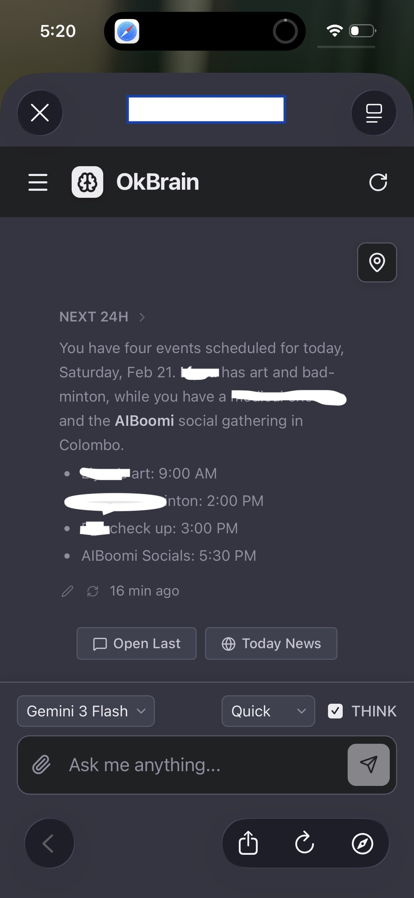

### Chat Interface
A clean conversational UI with AI thinking indicators and inline source citations. Switch between models and response modes right from the chat toolbar.

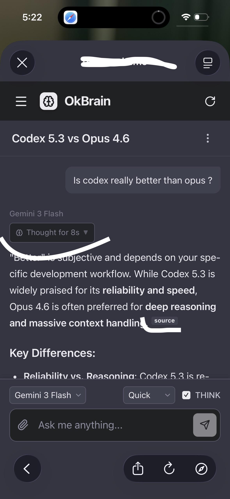

### Location Awareness
With optional location access, OkBrain can answer questions about your surroundings — like the closing time of a nearby café, or what's happening around you right now.

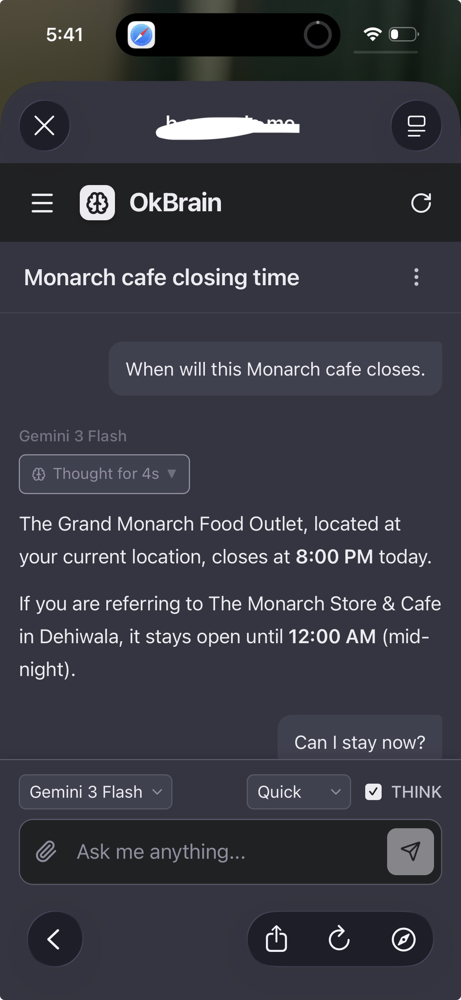

### Web Grounding
Answers backed by live web search, with inline source citations so you always know where the information comes from.

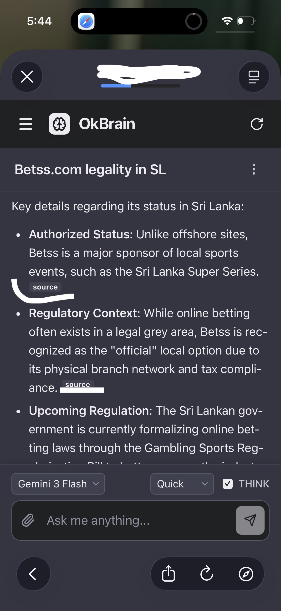

### Events & Calendar
Ask natural language questions about your schedule, or just say "add a meeting on Friday at 3pm" — OkBrain reads and writes your calendar events conversationally.

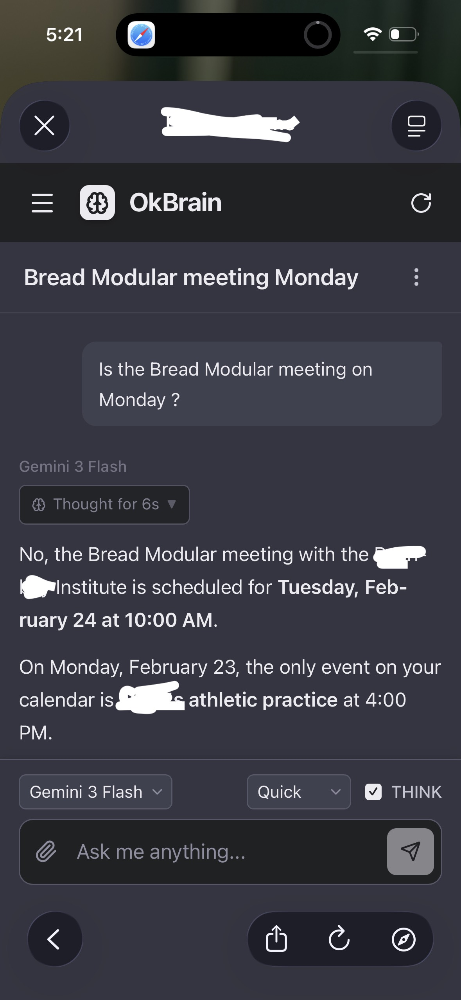

### File Uploads
Attach files — documents, images, PDFs — directly to any conversation and have the AI reason over them.

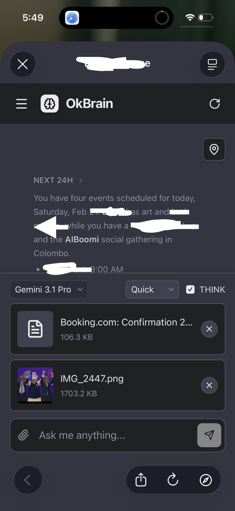

### Write & Edit Documents
A rich document editor with linked chat history and snapshot versioning, so you can write and iterate with AI assistance.

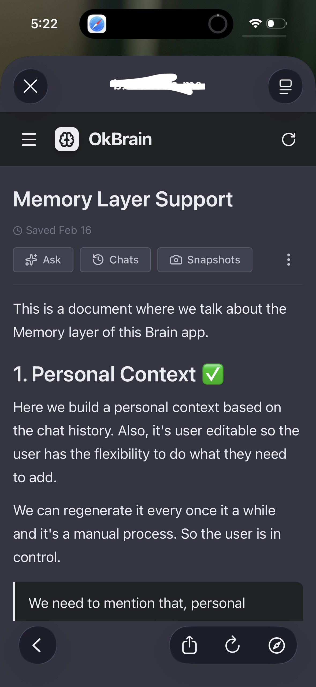

### Chat with Documents
Ask questions, get summaries, or brainstorm ideas grounded in your document's content. All related conversations are kept alongside the doc — you stay in control of the writing, while the AI helps you think.

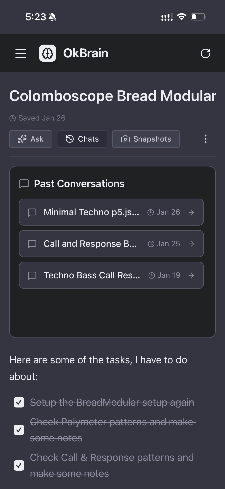

### Document Snapshots
Every draft is preserved. Browse and restore previous versions of your documents at any point in time.

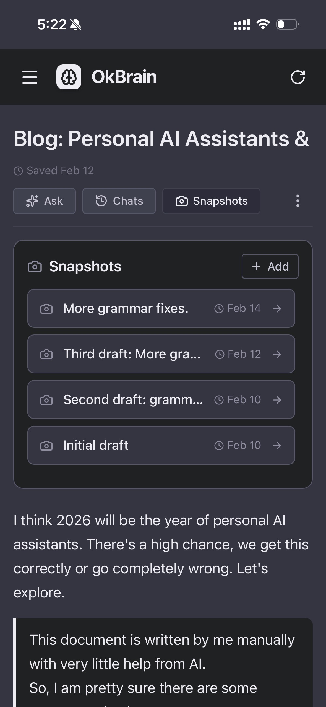

### Conversation Summarizations
Long technical conversations get automatically summarized into structured, scannable notes you can reference later.

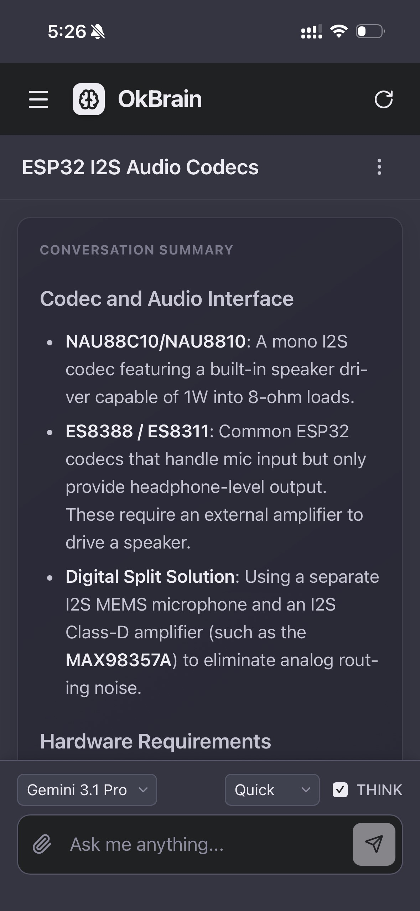

### Share Docs in Public
Publish any document(or chat conversation) as a public link on your own domain, making it easy to share your writing with anyone.

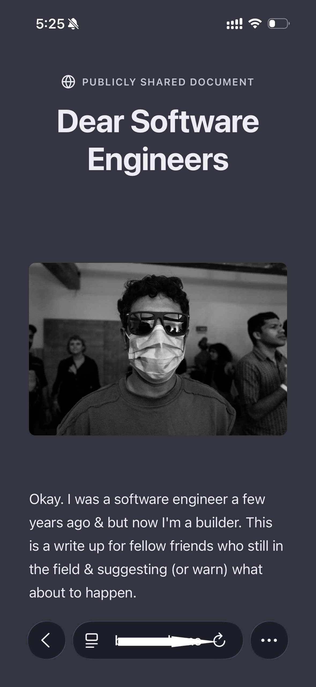

### User Memory
Define a personal context — your identity, preferences, and skills — that gets included in every AI conversation automatically.

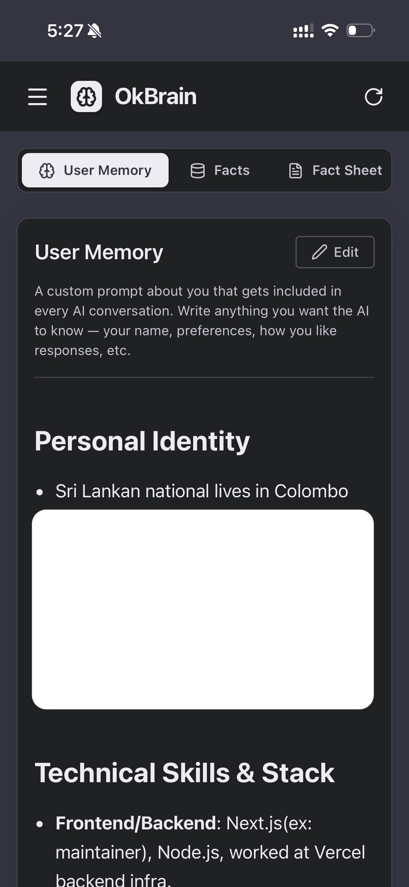

### Extracted Facts
Facts are automatically pulled from your conversations, categorized, and made searchable with semantic search.

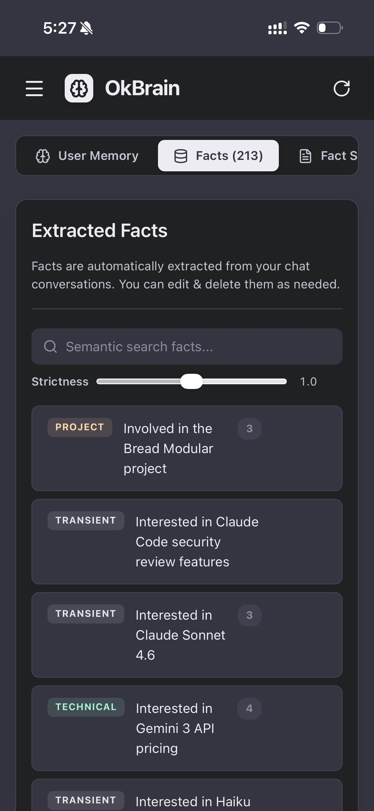

### Fact Sheet
A scored, ranked condensed set of your most important facts, injected into every conversation to keep the AI grounded in who you are.

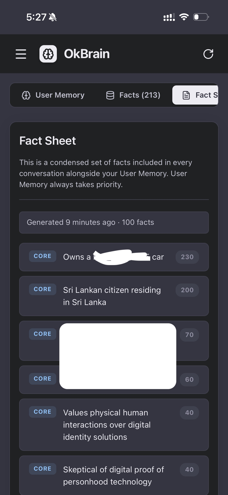

